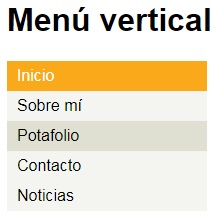

# Menú Vertical #

## Introducción
El presente trabajo consiste en replicar un menú de navegación. 
La finalidad es entender cómo crear estructuras en la web con html y a darle estilos con css.

##Contenido de las carpetas
Se tienen dos carpetas principales, la primera llamada assets, donde se aloja una carpeta adicional llamada images. En la carpeta images se almacena la imagen  utilizada en este Readme. La segunda carpeta llamada css, donde se almacena el archivo main.css usado para dar estilo y diseño a la página web.